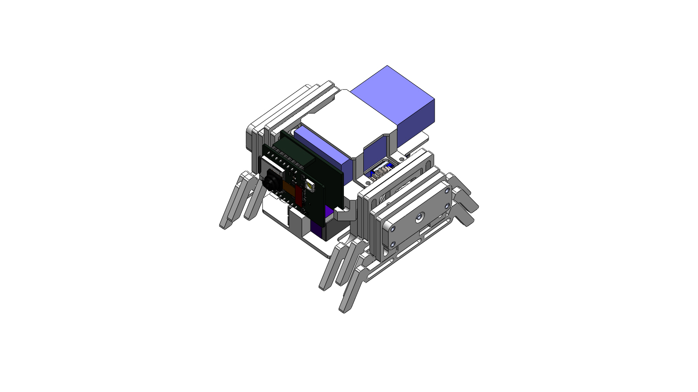

# NowDream
A small sized mobile vehicle based on ESP32 CAM module

<h1 align="center"> NowDream_Ver1 </h1>

 

Got the idea from https://twitter.com/i/status/1389885007238291457 and https://qiita.com/Nabeshin/items/1ad8ab0f0f66472a2325

**Vedio as below**
Videos are now available on YouTube (click below images to open):

